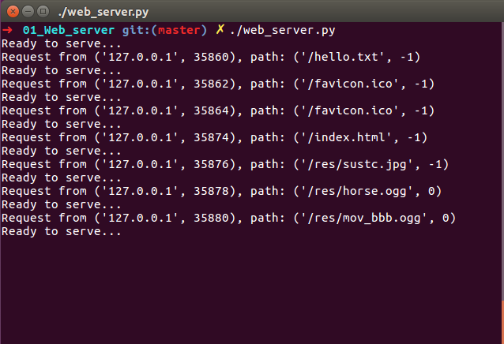
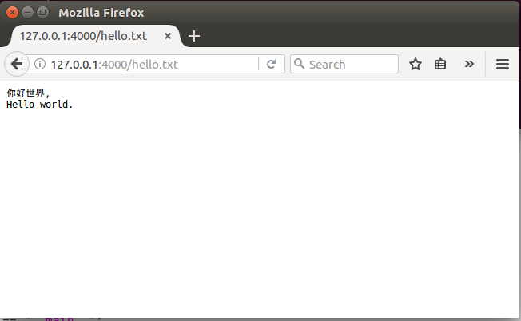
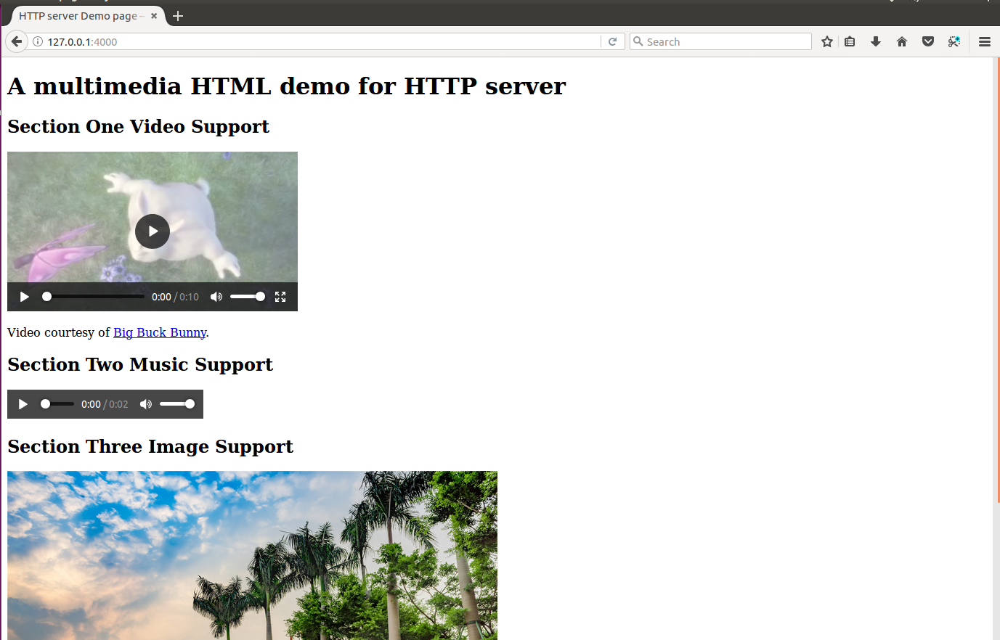
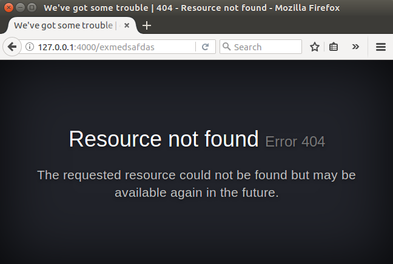
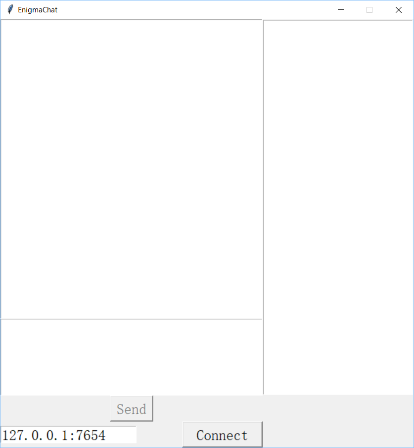
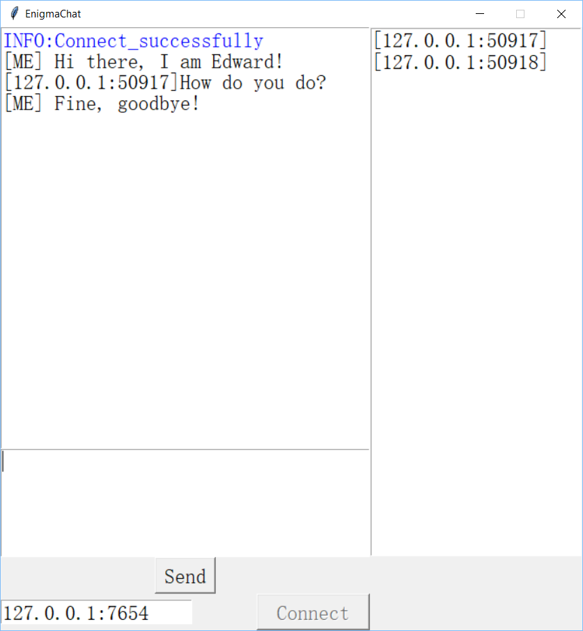
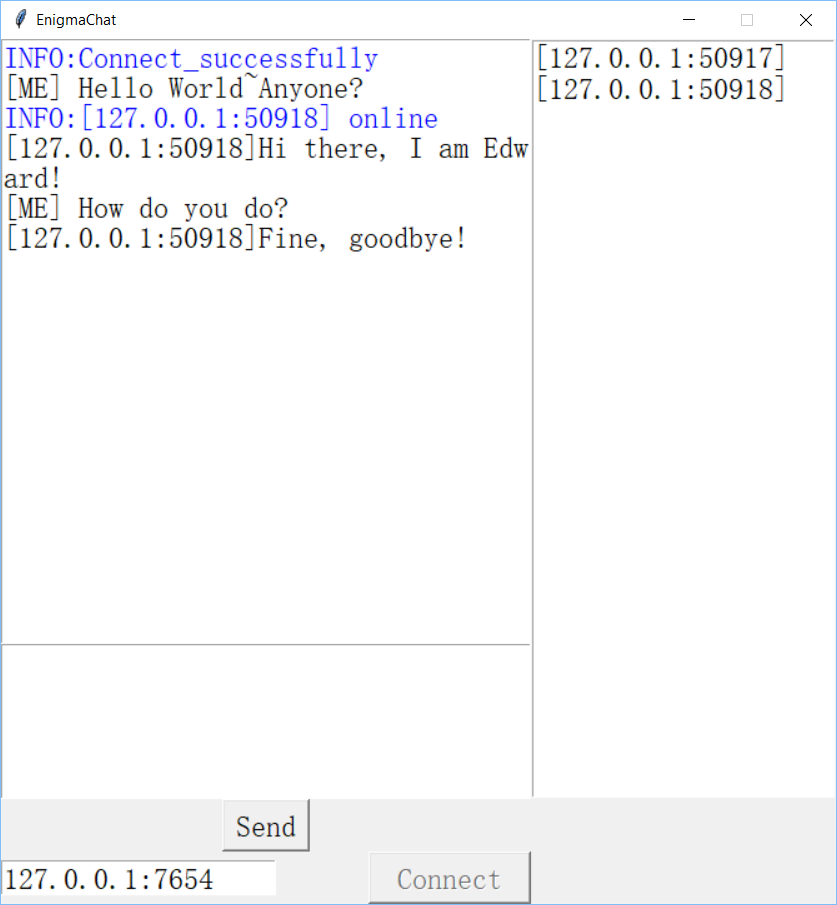
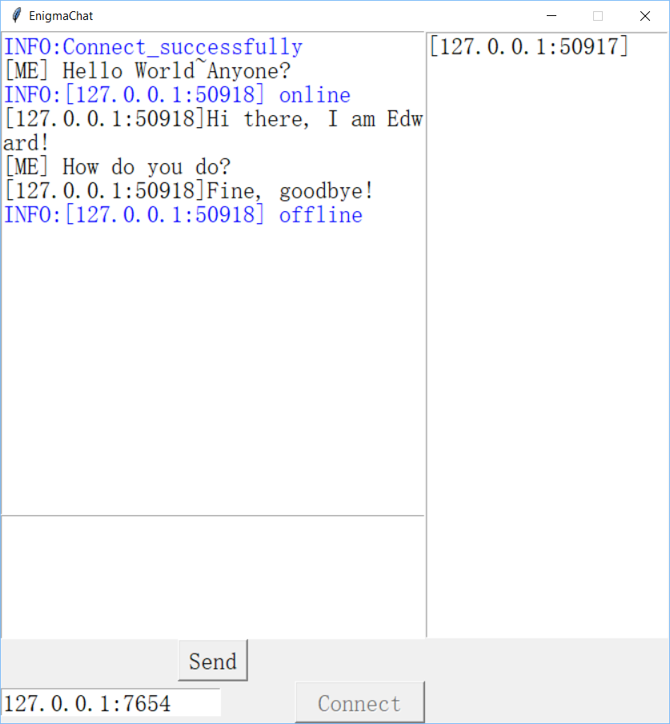

# Lab 05 Assignment Instructions

Author: Edward FANG YD

Date: 10/31/2017

## Assignment 01 Web_server

### Program Screenshots

- server CLI




- Text file including English and Chinese (UTF-8 encoded)



- Multimedia HTML page (including Video, Audio and Image)



- 404 NOT FOUND Page



### How To Use

The listening port and address are defined in `web_server.py`.
The default setting is `0.0.0.0` and `4000`, respectively.  The webroot is defined  in the same directory of `web_server.py`.

#### Unix-like

In the top directory, run `./web_server.py`

#### Windows

Open the command line tool, change into the project directory and type `python3 web_server.py`

### Code Structure

Firstly, in the main function, we use a loop to listen for the sockets connections and catch most of connection exceptions in the main loop. In the loop, we create two objects `Request` and `Response`, which are in charge of parsing the http request and generating http responses, respectively.

In the class `Request`, we define the `parse_request()` method for parsing the http request and `getpath()` method. In the program, we distinguish two kind of http request, normal http request and `partial request` by detecting the `Range` field in the request header. And the r`getpath()` method will return the file path and the starting byte position of partial request (`-1`, otherwise).

In the class `Response`, we will first check if the file is actually exists on the disk and decide the status code the server is going to response. In the `get_resp_header()` method, we generate proper header for different status code. And finally in the `send_file()` method, we send the required file content to the specific socket.

### Done and TODO

#### DONE

- http request processing and responsing
- File tranferring
- 200/404/406 Response
- HTML 404 Page
- Partial request processing for video streaming
- HTTP Header Encoding

#### TODO

- Conditional GET
- More file types recognition
- Custom Webroot Defination

### File Structure 
```
.
├── Err404.html -> 404 Page
├── hello.txt -> Text file
├── index.html -> Multimedia page
├── res -> video, audio and images
│   ├── horse.mp3
│   ├── horse.ogg
│   ├── mov_bbb.mp4
│   ├── mov_bbb.ogg
│   └── sustc.jpg
└── web_server.py -> webserver code
```
### Reference

- [Python-filestate](https://docs.python.org/2/library/os.html#os.stat)
- [rfc-7230](https://tools.ietf.org/html/rfc7230)
- [Python Pipebroken Exception](https://docs.python.org/3/library/exceptions.html#OSError)
- [How to handle a broken pipe (SIGPIPE) in python?](https://stackoverflow.com/questions/180095/how-to-handle-a-broken-pipe-sigpipe-in-python/180922#180922)
- [206 PARTIAL CONTENT](https://httpstatuses.com/206)
- [HTML Demo](https://www.w3schools.com/)

## Assignment 02 Online Chat Client-Server Architechture

### Program Screenshots

- Server Command Line Interface


- Disconnected Client



- Chatting Test & Log in/off







### How To Use

The server listening port and address are defined in `enigma_server.py`.
The default setting is `0.0.0.0` and `7654`, respectively. 

#### Unix-like

In the top directory, run `./enigma_server.py` or `./chatter.py` 

#### Windows

Open the command line tool, change into the project directory and type `python3 enigma_server.py` or `python3 chatter.py`

---

After running the server and the clients, clients should first input the address and port of server and then click `Connect`. After successful connecting to the server, one can send the message and see a list of online clients in the list at the right side.

### Code Structure

#### Server Part

In the server part code, `enigma_server.py`, we define a class `ChatServer` and its methods `start`, `accept_conn`, `process_message` and `broadcast`. In the main function, we just initilize a `ChatServer` object and start it.

Then, in the object `ChatServer`, we will store all the infomation such as  server_host, server_port, connected sockets, sockets' addresses, etc.. In the method, `start`, there is a main loop, which use Python `Selector` module to listen to the new connection and new message from the sockets. And then we dispath the connection into two methods, `accept_conn` and `broadcast`,  for further processing.

Note that in the message sent by the server, we distinguish the `INFO` and ordinary message from client. Thus, we can show different colored message in the Client side.

#### Client Part

We define four class in the `chatter.py`, they are `Chatwindows`, `Client`, `Sender` and `Receiver`. In these four class, we define the GUI, client net work communication control, message sending method and message receiving method, respectively.

The four instances are running in different threads and communicate  with each other through queue. For example, the main thread GUI will polling the queue continuously for the new received messages.

The client will distinguish between the chat message and the system info, which is specially colored in blue.

###  Reference

- [Tkinker Book](http://effbot.org/tkinterbook/)
- [GUI POLLING](http://effbot.org/tkinterbook/widget.htm#Tkinter.Widget.after-method)
- [select — Waiting for I/O completion](https://docs.python.org/3.6/library/select.html)
- [selectors — High-level I/O multiplexing](https://docs.python.org/3.6/library/selectors.html#module-selectors)
- [NETWORK PROGRAMMING II - CHAT SERVER & CLIENT](http://www.bogotobogo.com/python/python_network_programming_tcp_server_client_chat_server_chat_client_select.php)
- [Python threads: communication and stopping](https://eli.thegreenplace.net/2011/12/27/python-threads-communication-and-stopping)